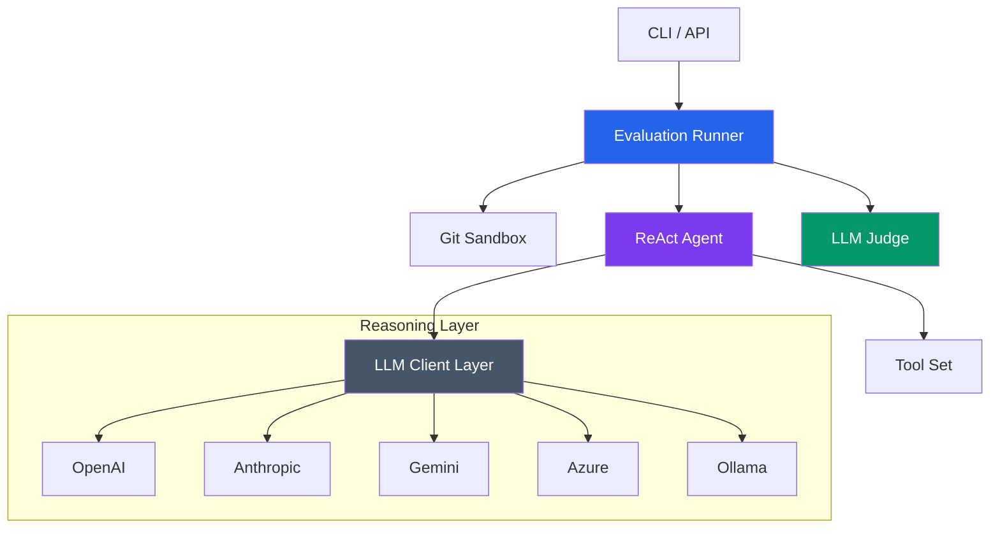

# Rails Agent Eval 🚀


*The gold standard for benching AI agent performance in real-world Ruby on Rails environments.*

---

## 💎 The Vision

`agent-eval` is a high-fidelity evaluation engine designed to rigorously validate AI agent skills, context hydration strategies, and reasoning workflows. It orchestrates side-by-side execution runs within **Isolated Git Sandboxes**, providing objective, data-driven insights into agent reliability and code quality.

---

## ✨ Premium Features

- **🎭 Side-by-Side Evaluation**: Quantify the "ROI of Context" by comparing baseline vs. skill-enhanced agent runs.
- **🛡️ Isolated Git Sandboxes**: Every run operates in a temporary repo. Clean diffs, zero side-effects, 100% reproducibility.
- **⚖️ LLM-Powered Judging**: Automatic, objective scoring of code changes against granular, task-specific criteria.
- **🔄 Sophisticated ReAct Loop**: Employs a robust `Thought → Tool → Observation` loop to handle complex, multi-step engineering tasks.
- **🌍 Multi-Provider Ecosystem**: Native support for **OpenAI**, **Anthropic**, **Google Gemini**, **Azure OpenAI**, **Ollama**, **Groq**, and **DeepSeek**.
- **📊 Standardized Intelligence**: Consistent reporting format regardless of the underlying LLM provider.

---

## 🏛️ Architecture Overview

The system decoupling allows the reasoning engine to remain agnostic of the execution environment.



---

## ⚙️ Configuration & Orchestration

### Environment Variable Mapping

| Provider | Required Env Variables | Registry Key |
| :--- | :--- | :--- |
| **OpenAI** | `OPENAI_API_KEY` | `:openai` |
| **Anthropic** | `ANTHROPIC_API_KEY` | `:anthropic` |
| **Gemini** | `GEMINI_API_KEY`, `GEMINI_PROJECT_ID`, `GEMINI_LOCATION` | `:gemini` |
| **Azure** | `AZURE_OPENAI_API_KEY`, `AZURE_OPENAI_ENDPOINT`, `AZURE_OPENAI_MODEL` | `:azure` |
| **Ollama** | `OLLAMA_MODEL` (e.g., `qwen2.5-coder`) | `:ollama` |
| **Groq** | `GROQ_API_KEY` | `:groq` |
| **DeepSeek** | `DEEPSEEK_API_KEY` | `:deepseek` |
| **OpenCode** | `OPENCODE_API_KEY` | `:opencode` |

> **Note:** Environment variables are automatically loaded. You can also set provider config in `.agent-eval.yml`.

### Pro-Tip: Token Optimization with `rtk`
> [!TIP]
> This repository is optimized for **Rust Token Killer (rtk)**. Use `rtk git status` or `rtk gain` to track your token savings while developing agent scenarios.

### Global Configuration
```ruby
Evaluator::Config.configure do |config|
  config.llm_provider = :anthropic # Choose from :openai, :anthropic, :gemini, :azure, :ollama
  config.timeout      = 180        # Generous timeout for complex reasoning
end
```

---

## 🚀 Getting Started

### Installation
Add to your `Gemfile`:
```ruby
gem 'agent-eval', github: 'igmarin/agent-eval'
```

Then install:
```bash
bundle install
```

### Usage: The 4-Step Flow

#### 1. Initialize Configuration
```bash
bundle exec agent-eval init --rails
```
This creates `.agent-eval.yml` with default providers and Rails-specific settings.

#### 2. Create a Skill
```bash
bundle exec agent-eval skill new my-service --mode=rails --template=service_object
```
Creates `skills/my-service/service.rb` with a Rails service object template.

**Available Templates:**
- `service_object` → `service.rb`
- `concern` → `concern.rb`
- `active_record_model` → `model.rb`

#### 3. Create an Eval
```bash
bundle exec agent-eval eval new my-first-eval --runtime=rails
```
Creates `evals/my-first-eval/` with `task.md` and `criteria.json`.

#### 4. Run the Eval
```bash
bundle exec agent-eval run my-first-eval --skill=my-service --provider=openai
```

**Output Formats:**
- Human-readable (default)
- JSON: `--ci` flag
- JUnit XML: for CI/CD integration

---

## 🛡️ Reliability & Security

- **Safe-by-Design**: No code execution occurs on the host system; everything happens in the sandbox.
- **Traceability**: Every thought and tool call is logged with full backtrace for post-mortem analysis.
- **Robust Error Recovery**: Handles provider outages and rate limits gracefully with standardized error logging.
- **XML-Safe Output**: JUnit XML output is properly escaped to prevent injection attacks.
- **Template Allowlisting**: Rails skill templates use explicit allowlists to prevent arbitrary method dispatch.
- **Test Coverage**: 326+ tests covering core engine, CLI commands, and all provider clients.

## 🧪 Testing

The project uses Minitest with WebMock for HTTP stubbing.

```bash
# Run all tests
bundle exec rake test

# Run with coverage
bundle exec rake test COVERAGE=true

# Run specific test file
bundle exec ruby -Itest test/agent_eval/commands/skill_new_test.rb
```

**Test Structure:**
- `test/evaluator/` — Core evaluation engine tests
- `test/agent_eval/` — CLI and models tests
- `test/clients/` — Provider client tests
- `test/skills/` — Skill service tests

## 📊 CI/CD Integration

GitHub Actions workflow included (`.github/workflows/ci.yml`):
- Runs on push and pull requests
- Tests against Ruby 3.3 and 3.4
- Executes rubocop, reek, and minitest
- Outputs JUnit XML for test reporting

```bash
# Run locally with CI output
bundle exec agent-eval run my-eval --skill=my-skill --provider=openai --ci
```

---

## 📄 License
The gem is available as open source under the terms of the [MIT License](LICENSE).
