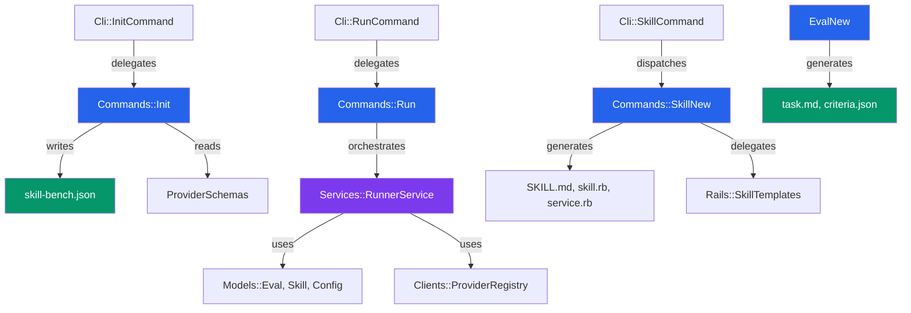

# ⚡ Command Layer

The `lib/skill_bench/commands` directory contains the **Domain Command** implementations of the SkillBench system. Each command represents a single, atomic user-facing operation — generating config files, running evaluations, or scaffolding new skills and evals.

Commands sit between the CLI layer (`lib/skill_bench/cli/`) and the service layer (`lib/skill_bench/services/`). They are responsible for **orchestration** (calling services) and **file I/O** (generating configs, creating directories, writing templates).

---

## 🏛️ Architecture & Patterns

The command layer follows the **Command Pattern** — each operation is encapsulated in a class with a single `.run` entry point. This keeps the CLI thin and makes commands independently testable.

### System Flow



### Core Commands

| Command | Responsibility | Delegates To |
|---------|---------------|--------------|
| **`Init`** | Generates `skill-bench.json` config file | `ProviderSchemas` |
| **`Run`** | Orchestrates evaluation execution | `RunnerService` |
| **`SkillNew`** | Scaffolds new skills (simple/advanced/rails) | `Rails::SkillTemplates` |
| **`EvalNew`** | Scaffolds new evals with task/criteria | — |

---

## 🎯 Design Principles

### Pure Class Methods

All commands expose a single `.run` class method. No state is maintained — each call is independent and idempotent:

```ruby
# Generating config
Commands::Init.run(provider: :openai, force: true)

# Running an eval
result = Commands::Run.run(eval_name: 'my-eval', skill_name: 'my-skill')
# => { pass: true, score: 0.95, ... }

# Scaffolding a skill
Commands::SkillNew.run(name: 'api-client', mode: 'rails', template: 'service_object')
```

### Fail Fast with Clear Errors

Commands validate preconditions and raise descriptive errors:

```ruby
def self.run(provider:, force: false)
  raise "Config file '#{Config::CONFIG_FILENAME}' already exists. Use --force to overwrite." if File.exist?(Config::CONFIG_FILENAME) && !force
  # ...
end
```

### File I/O Is Explicit

Commands create directories and write files directly. No hidden side effects:

```ruby
def self.run(name:, runtime: 'generic')
  eval_path = File.join('evals', name)
  FileUtils.mkdir_p(eval_path)
  create_task_md(eval_path, name)
  create_criteria_json(eval_path, runtime)
end
```

---

## 📋 Command Reference

### `Init` — Configuration Generation

Generates a single-provider `skill-bench.json` file with sensible defaults:

```json
{
  "provider": "openai",
  "max_execution_time": 30,
  "config": {
    "api_key": null,
    "model": "gpt-4o"
  }
}
```

**Parameters:**

- `provider` (Symbol): One of `:openai`, `:anthropic`, `:gemini`, `:ollama`, `:azure`, `:groq`, `:deepseek`, `:opencode`
- `force` (Boolean): Overwrite existing config file

### `Run` — Evaluation Execution

The thinnest command — it simply delegates to `RunnerService`:

```ruby
def self.run(eval_name:, skill_name:)
  Services::RunnerService.call(
    eval_name: eval_name,
    skill_name: skill_name
  )
end
```

This indirection allows the CLI to validate arguments before invoking the heavy service layer.

### `SkillNew` — Skill Scaffolding

Supports three modes of skill creation:

| Mode | Files Created | Use Case |
|------|--------------|----------|
| `simple` | `SKILL.md` | Markdown-based skill definition |
| `advanced` | `skill.rb` | Ruby class skeleton |
| `rails` | `service.rb`, `concern.rb`, or `model.rb` | Rails-specific patterns |

**Rails Templates:**

- `service_object` — Standard `.call` pattern service
- `concern` — Rails concern module
- `active_record_model` — AR model with validations

### `EvalNew` — Eval Scaffolding

Creates an eval directory with:

- **`task.md`** — Description of the task for the AI agent
- **`criteria.json`** — Scoring thresholds:

  ```json
  {
    "runtime": "rails",
    "pass": { "score_threshold": 0.8 }
  }
  ```

**Parameters:**

- `name` (String): Eval directory name
- `runtime` (String): `"generic"` or `"rails"` (adds `rails_helper.rb`)

---

## 🛠️ Adding a New Command

1. **Create the command file** in `lib/skill_bench/commands/my_command.rb`:

   ```ruby
   # frozen_string_literal: true

   module SkillBench
     module Commands
       class MyCommand
         # Run the my command
         # @param name [String] Required parameter
         # @param option [String] Optional parameter
         # @return [Hash] Result data
         def self.run(name:, option: 'default')
           validate!(name)

           # Perform operation
           result = perform_operation(name, option)

           { success: true, data: result }
         end

         private

         def self.validate!(name)
           raise ArgumentError, "Name is required" if name.nil? || name.empty?
         end

         def self.perform_operation(name, option)
           # Implementation
         end
       end
     end
   end
   ```

2. **Register in the CLI** (`lib/skill_bench/cli/`):
   - Add a new `*Command` class that parses options and delegates to `Commands::MyCommand.run(...)`
   - Update `HelpPrinter` with the new subcommand

3. **Write tests** in `test/commands/my_command_test.rb`

---

## 🧪 Testing Commands

Commands are pure class methods — test them directly:

```ruby
def test_init_creates_config_file
  Dir.mktmpdir do |dir|
    Dir.chdir(dir) do
      SkillBench::Commands::Init.run(provider: :mock)
      assert_path_exists 'skill-bench.json'

      config = JSON.parse(File.read('skill-bench.json'), symbolize_names: true)
      assert_equal 'mock', config[:provider]
    end
  end
end

def test_skill_new_creates_skill_md
  Dir.mktmpdir do |dir|
    Dir.chdir(dir) do
      SkillBench::Commands::SkillNew.run(name: 'test-skill', mode: 'simple')
      assert_path_exists 'skills/test-skill/SKILL.md'
    end
  end
end
```

---

## 📁 File Structure

| File | Responsibility |
|------|---------------|
| `init.rb` | Generates `skill-bench.json` with provider defaults |
| `run.rb` | Thin wrapper around `RunnerService` |
| `skill_new.rb` | Scaffolds skills (simple/advanced/rails modes) |
| `eval_new.rb` | Scaffolds evals with task.md and criteria.json |

---

## 🔗 Related Documentation

- `lib/skill_bench/cli/README.md` — CLI layer (parses args, delegates here)
- `lib/skill_bench/services/README.md` — Service layer (orchestrates evaluation)
- `lib/skill_bench/rails/skill_templates.rb` — Rails template definitions
- `docs/first-eval-guide.md` — User-facing tutorial
